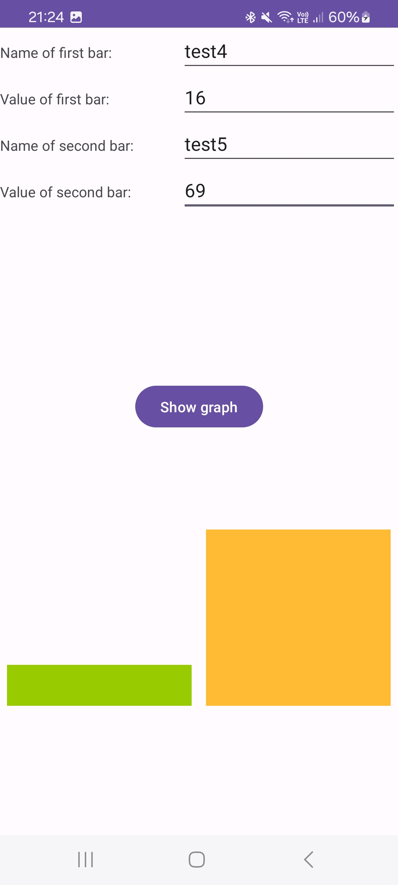
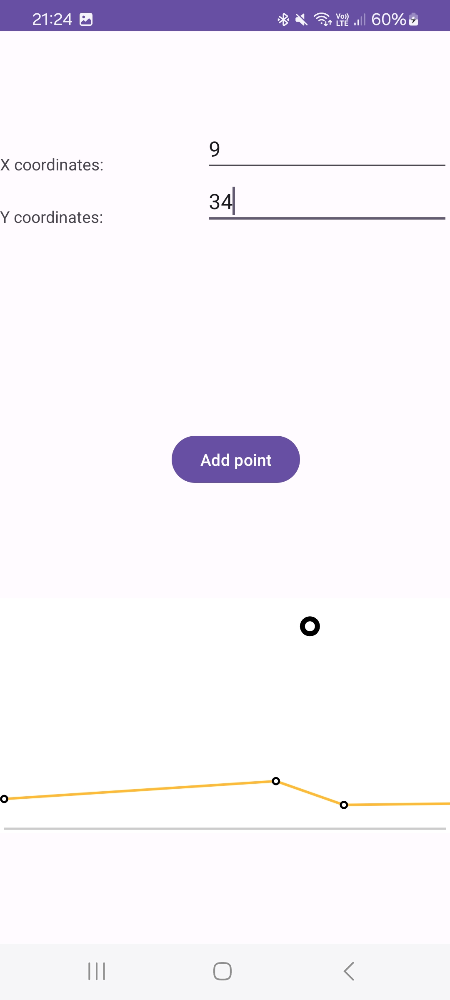

# HoloGraph Library example

## Zakaj HoloGraph Library?
Knjižnica Holo Graph Library je znana odprtokodna grafična knjižnica, ki se uporablja v androidnih aplikacijah za ustvarjanje grafov in diagramov za uporabnike.
Ta temelji na slogu Holo sistema Android in je združljiv z vsemi sodobnimi in standardno skladnimi aplikacijami.
V knjižnico so vključeni naslednji diagrami: črtni grafi, linijski grafi in krožni diagrami.

## Prednosti/slabosti

### Prednosti:

### Slabosti:

## Licenca

Uporablja se licenca The Apache Software License, Version 2.0, ki omogoča uporabo v različnih projektih.

## Št. uporabnikov

Informacije o številu uporabnikov niso navedene.

## Vzdrževanje projekta

Verzija: 0.1.0

## Posnetki zaslona aplikacije
### Stolpični diagram

### Črtni diagram

### Tortni diagram

