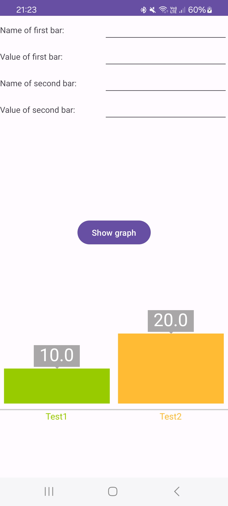
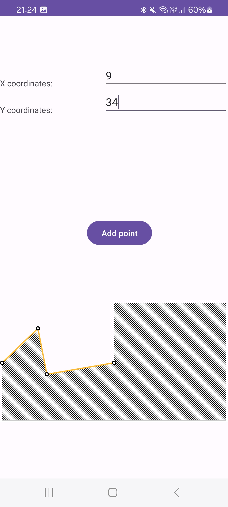
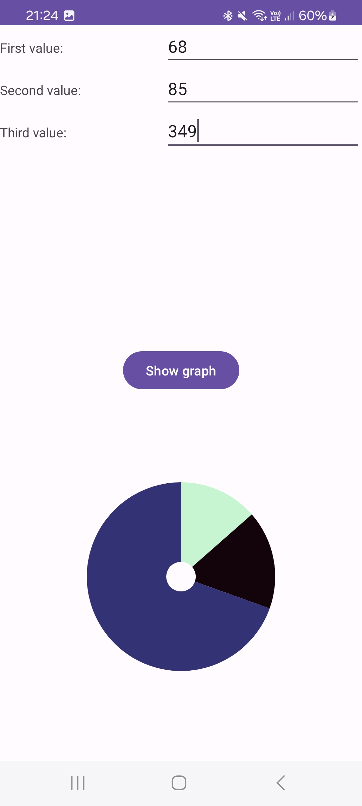

# HoloGraph Library example

## Zakaj HoloGraph Library?
Knjižnica Holo Graph Library je znana odprtokodna grafična knjižnica, ki se uporablja v androidnih aplikacijah za ustvarjanje grafov in diagramov za uporabnike.
Ta temelji na slogu Holo sistema Android in je združljiv z vsemi sodobnimi in standardno skladnimi aplikacijami.
V knjižnico so vključeni naslednji diagrami: črtni grafi, linijski grafi in krožni diagrami.

## Prednosti/slabosti

### Prednosti:

Zelo lahka in intuitivna uporaba knjižnice. Prikaz preprostih grafov. Deluje samo z vklučitvijo:
-     implementation("org.quanqi:android-holo-graph:0.1.0")

### Slabosti:

Slaba podprtost projekta, zadnji popravek 30.10.2017. Na grafe ne moramo dodajati osi, grafi niso primerni za bolj znanstven prikaz podatkov. 

## Licenca

Uporablja se licenca The Apache Software License, Version 2.0

## Št. uporabnikov

Informacije o številu uporabnikov niso navedene.

## Vzdrževanje projekta

- Verzija: 0.1.0
- Glavni razvijalci: Daniel Nadeau, Louis Teboul
- Število razvijalcev: 34
- Zadnji popravek:  30.10.2017

## Uporaba v xml
### Stolpični diagram
        
        <com.echo.holographlibrary.BarGraph
                    android:id="@+id/graph"
                    android:layout_width="match_parent"
                    android:layout_height="200dp"
                    app:layout_constraintBottom_toBottomOf="parent"
                    app:layout_constraintEnd_toEndOf="parent"
                    app:layout_constraintStart_toStartOf="parent"
                    app:layout_constraintTop_toTopOf="@+id/guideline2" />

### Črtni diagram

        <com.echo.holographlibrary.LineGraph
            android:id="@+id/graph"
            android:layout_width="match_parent"
            android:layout_height="200dp"
            app:layout_constraintBottom_toBottomOf="parent"
            app:layout_constraintEnd_toEndOf="parent"
            app:layout_constraintStart_toStartOf="parent"
            app:layout_constraintTop_toTopOf="@+id/guideline7" />

### Tortni diagram

      <com.echo.holographlibrary.PieGraph
          android:id="@+id/graph"
          android:layout_width="match_parent"
          android:layout_height="200dp"
          app:layout_constraintBottom_toBottomOf="parent"
          app:layout_constraintEnd_toEndOf="parent"
          app:layout_constraintStart_toStartOf="parent"
          app:layout_constraintTop_toTopOf="@+id/guideline3" />

## Posnetki zaslona aplikacije
### Stolpični diagram

### Črtni diagram

### Tortni diagram

